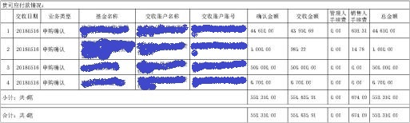
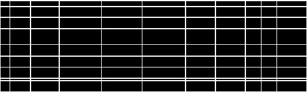
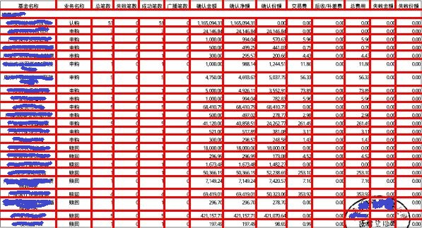

### Split&Merge: Table Recognition with Pytorch

An implementation of Table Recognition Model Split&Merge in Pytorch.  Split&Merge is an efficient convolutional neural network architecture for recognizing table structure from images. For more detail, please check the paper from ICDAR 2019: Deep Splitting and Merging for Table Structure Decomposition

## Usage

**Clone the repo:**

```
git clone https://github.com/solitaire2015/Split_Merge_table_recognition.git
pip install -r requirements.txt
```

**Prepare the training data:**

The input of the Split model and Merge model should be an image which has one channels or three channels,  I used three channels image, ones channel is gray scale image, the other two are segmentation mask in vertical and horizontal direction. You can use gray scale image only by setting number of channels to 1 and dataset suffix to `.jpg`.

<u>Split model</u>

The ground truth of Split model is loaded from a `.json`  file, the structure of the file is like:

``````
{
“img_1”:{"rows":[0,0,1,0,1,1],"columns":[1,0,0,1,1,1,1]},
“img_2”:{"rows":[0,0,1,0,1,1],"columns":[1,0,0,1,1,1,1]}
}
``````

Where `row`  indicates if it's a line in corresponding row of the image, the length of `row` is height of the image. `columns` indicates corresponding column the length is width of the image.

<u>Merge model</u>

The ground truth of Merge is loaded from a `.json` file, here is the structure:

``````
{
“img_1”:{"rows":[0,0,1,0,1,1],
		 "columns":[1,0,0,1,1,1,1],
		 "h_matrix":[[0,0,0],
		 			 [1,0,1]]},
		 "v_matrix":[[0,1,0],
		 			 [0,0,1]]}
}
``````

where the `h_matrix` indicates where the cells should be merged with it's right neighborhood, `v_matrix` indicates where the cells should be merged with it's bottom neighborhood, check more detail from the original paper, `h_matrix` and `v_matrix` are `R`  and `D` in that paper.

**Training**

<u>Train Split model :</u>

``````
python split/train.py --img_dir your image dir -- json_dir your json file -- saved_dir where you want to save model --val_img_dir your validation image dir -- val_json your validation json file
``````

<u>Train Merge model:</u>

``````
python merge/train.py --img_dir your image dir -- json_dir your json file -- saved_dir where you want to save model --val_img_dir your validation image dir -- val_json your validation json file
``````
Pre-trained models:	
* Merge: https://pan.baidu.com/s/112ElDK-MSMQ50CTKpkPCZQ code:rto4

* Split: https://pan.baidu.com/s/1rSO6o23WbKV6jXo2DRrQcw code:lu23

<u>Run the predict script:</u>

``````
jupyter notebook
``````

Open `Split_predict.ipynb` and `Merge_predict.ipynb` in your browser.

## Result

I didn't test the model on public ICDAR table recognition competition dataset, I test the model on my private dataset and got 97% F-score, you can test on ICDAR dataset by yourself.

Here are some example:

## Images



Fig1. Original image



Fig2. Split result



Fig3. one Merge result.

